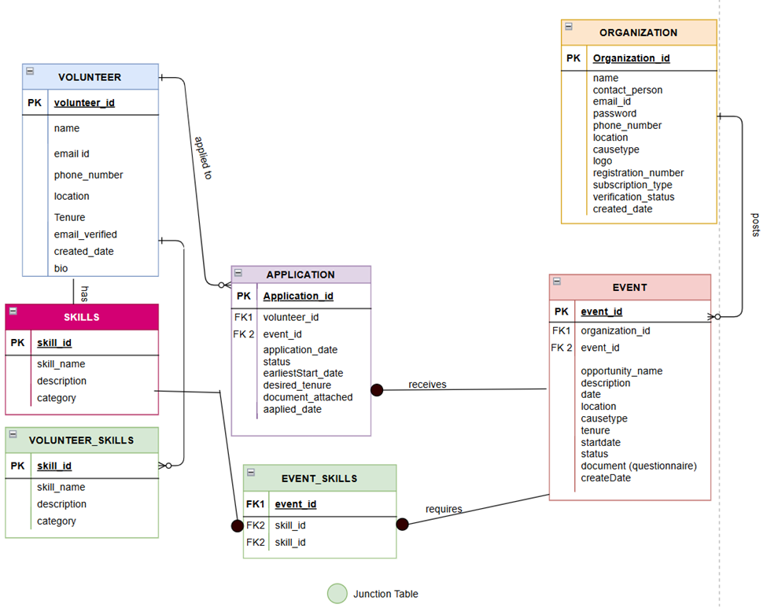

# Volunteer Management Database System

SQL database I designed to help nonprofits and volunteers actually find each other in Ontario. Built this for my database management course, but it tackles a real problem I kept seeing around Toronto.

## The Problem

Ontario has 58,000 registered nonprofits and over 4 million people who want to volunteer. But they're not connecting efficiently. Volunteers can't find opportunities that match their skills, and nonprofits waste time sorting through applications from people who aren't a good fit.

I've seen this firsthand - classmates with data analysis and design skills want to volunteer, but they have no idea which local organizations need those specific skills. Meanwhile, NGOs post opportunities on Facebook groups and hope the right people see them.

## My Solution

A database-driven matching system with:
- **Smart filtering** by skills, location, and availability
- **Business model** that works (free for volunteers, $29.99/month premium for organizations)
- **Clean data structure** using 7 normalized tables
- **33 SQL queries** handling everything from searching to analytics

## Database Structure

I built this around 7 tables in Third Normal Form:

**Main tables:**
- Volunteers (profiles, skills, location, availability)
- Organizations (with verification and subscription status)
- Events (volunteer opportunities with requirements)
- Skills (standardized list to avoid "Event Planning" vs "Events Management" confusion)

**Connection tables:**
- Volunteer_Skills (links volunteers to what they can do)
- Event_Skills (links opportunities to what's needed)

**Tracking:**
- Applications (who applied where, current status)



The junction tables were crucial - they let me handle many-to-many relationships properly. One volunteer can have multiple skills, one event can need multiple skills, and the matching algorithm works by finding overlaps.

## Query Examples

**Finding the right volunteers for an opportunity:**
```sql
SELECT DISTINCT
    e.opportunity_name,
    o.name AS organization_name,
    GROUP_CONCAT(s.skill_name, ', ') AS required_skills
FROM event e
JOIN organization o ON e.organization_id = o.organization_id
JOIN event_skills es ON e.event_id = es.event_id
JOIN skills s ON es.skill_id = s.skill_id
WHERE e.status = 'open'
  AND e.location LIKE '%Toronto%'
  AND e.event_id IN (
      SELECT es2.event_id
      FROM event_skills es2
      WHERE es2.skill_id IN (
          SELECT vs.skill_id 
          FROM volunteer_skills vs 
          WHERE vs.volunteer_id = 3
      )
  )
GROUP BY e.event_id, e.opportunity_name, o.name;
```

This 4-table join with a subquery finds events where the required skills match what a specific volunteer actually has.

**Implementing the freemium paywall at the database level:**
```sql
SELECT
    v.name AS volunteer_name,
    v.location,
    GROUP_CONCAT(s.skill_name, ', ') AS skills,
    CASE 
        WHEN o.subscription_type = 'Premium'
        THEN v.email_id 
        ELSE '[Upgrade to Premium to view contact]'
    END AS email_display
FROM application a
JOIN volunteer v ON a.volunteer_id = v.volunteer_id
JOIN event e ON a.event_id = e.event_id
JOIN organization o ON e.organization_id = o.organization_id
LEFT JOIN volunteer_skills vs ON v.volunteer_id = vs.volunteer_id
LEFT JOIN skills s ON vs.skill_id = s.skill_id
WHERE o.organization_id = 5
GROUP BY a.application_id, v.name, v.location, o.subscription_type;
```

Using CASE statements to control access means even if someone hacks the application layer, they can't bypass the paywall - it's enforced at the data level.

## What I Learned from the Data


Ran some analytics on sample data and found interesting patterns:

**The 60% premium conversion rate surprised me** - way higher than typical freemium products (usually 2-5%). Organizations genuinely want volunteer contact info enough to pay for it.

**Geography matters a lot:**
- Montreal/Ottawa: 50% of volunteers had all required skills for local events
- Toronto: 30% complete matches
- Kingston: Only 15% - rural areas have real skill shortages

**Volunteers care about career development:**
- Sports/Youth programs got 2.5x more applications than humanitarian causes
- People want opportunities where they can build resume-worthy skills
- Health and tech skills are undersupplied - only 2 volunteers each in my sample

This would change how I'd market the platform. Instead of "help your community" messaging, I'd emphasize "gain leadership experience" and "build your portfolio."

## Technical Choices

**Database:** Started with SQLite for development, designed for MySQL in production

**Normalization:** Third Normal Form to avoid update anomalies. Early designs had skills as comma-separated text in the Volunteer table - that was a mess to query. Moving to a dedicated Skills table with junction resolution added two tables but made everything cleaner.

**Security:** 
- Passwords never stored in plaintext (bcrypt with 12 salt rounds)
- Foreign key constraints prevent orphaned data
- Email verification before account activation
- Soft deletion for audit trails

**Architecture plan:**
If this went to production, I'd deploy on AWS Canada (Montreal) for PIPEDA compliance:
- React frontend with CloudFront CDN
- Node.js/Express API layer
- RDS MySQL + S3 for file storage
- Redis for caching reference data

Estimated cost: $80-125/month initially, scaling to $300-500 at full adoption.

## Project Files
```
/sql/
  ├── queries.sql    # All 33 queries with comments
  └── schema.sql     # Table definitions
  
/images/
  ├── ERD_diagram.png              # Database design
  ├── dashboard_platform.png       # Platform metrics
  └── dashboard_organization.png   # Org analytics
```

## Skills I Practiced

**Database work:**
- Designing ERDs and normalizing to 3NF
- Writing complex multi-table JOINs
- Using subqueries for filtering
- Aggregate functions (COUNT, GROUP_CONCAT, AVG)
- Conditional logic with CASE statements

**Business thinking:**
- Translating user needs into database constraints
- Defining KPIs that actually matter
- Building a freemium model that people would pay for
- Analyzing data to find strategic insights

**Problem solving:**
- Handling many-to-many relationships properly
- Enforcing business rules at the database level
- Balancing normalization with query performance

## What I'd Do Next

If I kept working on this:

1. **Add machine learning** - predict which volunteers are most likely to actually show up based on past behavior
2. **Build the actual app** - right now it's just the database design and queries
3. **Test with real organizations** - see if my assumptions about premium conversion hold up
4. **Add location radius search** - "show me opportunities within 10km" instead of just by city

## Context

Built this for my Database Management course at Northeastern's MPS Analytics program. Wanted to work on something that solved an actual problem I'd seen, not just a toy example.

The full academic report with user personas, detailed business analysis, and security considerations is in the /docs folder if you want more depth.

---

**Samidha Basrur**  
MPS Analytics @ Northeastern University | 3.9 GPA  
Currently looking for September 2026 co-op in business analytics/consulting  

[LinkedIn](your-linkedin-url) | [GitHub](https://github.com/samidha-basrur)
